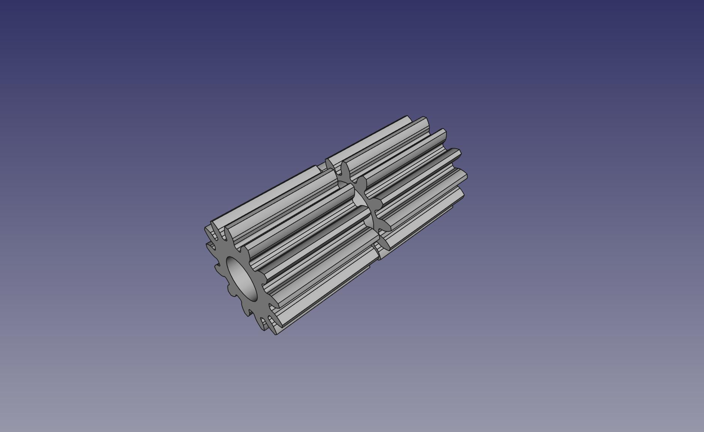

# Pinion Gear for ALPS Plotter Engine

Pinion Gear for the ALPS Plotter engine used in at least [these](http://tandy.wiki/CGP-115) plotters.

One plotter needs 2 of these gears, one for the X motor and one for the Y motor. The model is a single piece with both gears you print as one piece which you snap apart.

Shapeways "Fine Detail Plastic" option is accurate enough to produce this.

This model was simply generated from the "involute gear" plugin in FreeCAD.
